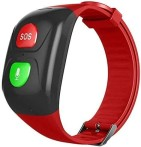

# Safety Wristband
Safety wristband is a device allowing the seniors to alert their family member in case of fall or difficulty.

 

> :warning:  This project is at its initial development and can't be used yet.
## Architecture
Microcontroller:
- ? **TO BE DEFINED**

Functional peripherals:
- GPS-GNSS
- GSM-GPRS
- Microphone
- SIM Card

Power supply:
- Cell button (1 or 2) **TO BE DEFINED**

## Getting Started

## TO DO 
:triangular_flag_on_post: Choose a microcontroller

:triangular_flag_on_post: Choose peripherals

:triangular_flag_on_post: Create a POC

:triangular_flag_on_post: Design schematic and power supply

